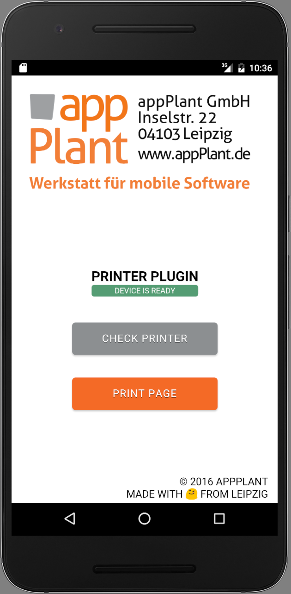
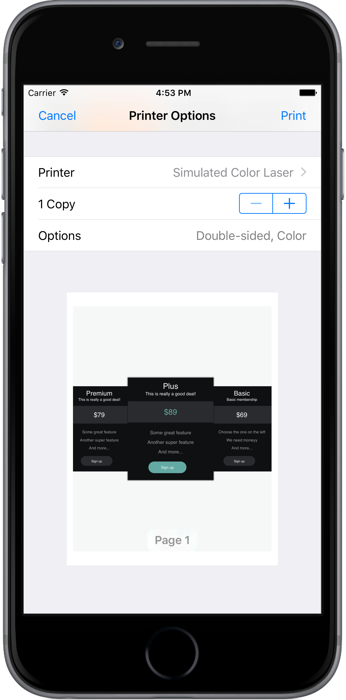
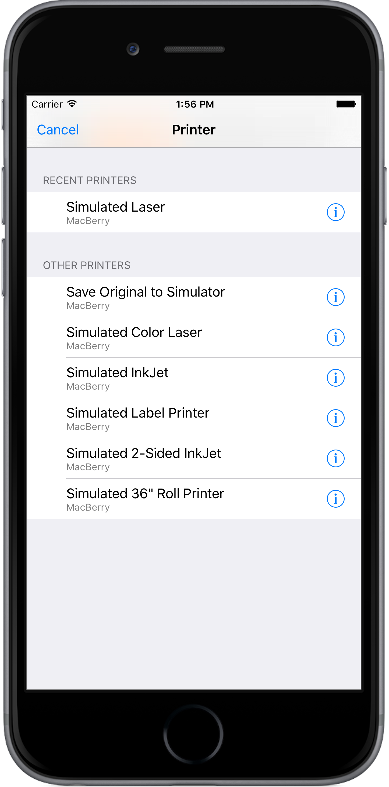
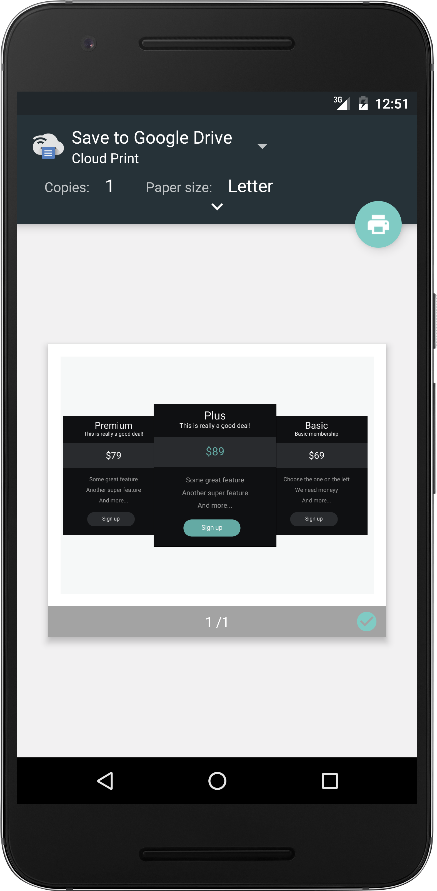
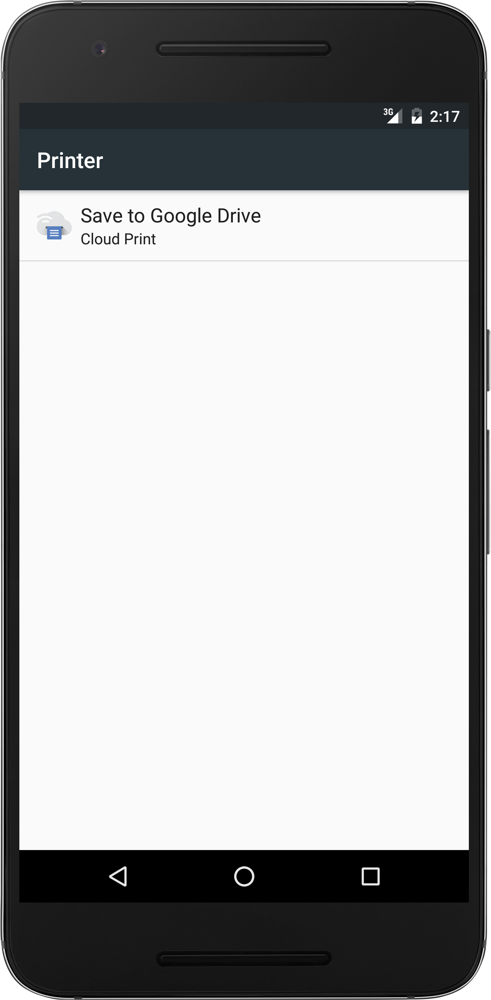

Cordova Print Plugin - Sample App
=================================



[Cordova][cordova] plugin to print HTML documents using [AirPrint][AirPrint] and [Android Printing Framework][APF].

## Instructions
Clone the _example_ branch:

    git clone -b example https://github.com/katzer/cordova-plugin-printer.git

And then execute:

    cordova run [ios|android|windows]

These will lunch the simulator or any plugged in device and start the example application as seen below in the screenshots. It is also possible to open the project with [Android Studio][studio], [Xcode][xcode] or [Visual Studio][vs].

A click on the _PRINT_ opens the native print dialog.

```javascript
page = '<style type="text/css">...</style><body>...</body>';

cordova.plugins.printer.print(page, { duplex: 'short' }, function (done) {
    alert(done ? 'done' : 'canceled');
});
```

Please read the plugin's [README][readme] for further requirements and informations.


### Testing in the iOS Simulator
There's no need to waste lots of paper when testing - if you're using the iOS simulator, install the [Hardware IO Tools for Xcode][xcode_io_tools] and select _Xcode -> Open Developer Tool -> Printer Simulator_ to open some dummy printers.


### Testing in the Android Simulator
There's no need to waste lots of paper when testing - if you're using the Android simulator, select _Save to PDF_.

Dont forget to install a PDF viewer like [MuPDF][mupdf], otherwise Android will not open the file. Note that you need to install the app for the right hardware architecture!

## Screenshots
The plugin comes with a native UI for
 - print dialog when invoking the plugin's _print_ method
 - picker dialog when invoking the plugin's _pick_ method

<p align="center">
    </img>
    &nbsp;
    </img>
    &nbsp;
    </img>
    &nbsp;
    </img>
</p>


## License

This software is released under the [Apache 2.0 License][apache2_license].

Made with :yum: from Leipzig

© 2016 [appPlant GmbH][appplant]


[cordova]: https://cordova.apache.org
[APF]: http://www.techotopia.com/index.php/Printing_with_the_Android_Printing_Framework
[AirPrint]: http://support.apple.com/kb/ht4356
[readme]: https://github.com/katzer/cordova-plugin-printer/blob/master/README.md
[studio]: https://developer.android.com/sdk/installing/studio.html
[xcode]: https://developer.apple.com/xcode/
[vs]: https://www.visualstudio.com
[xcode_io_tools]: http://justabeech.com/2015/01/12/hardware-io-tools-for-xcode/
[mupdf]: http://www.mupdf.com
[apache2_license]: http://opensource.org/licenses/Apache-2.0
[appplant]: www.appplant.de
